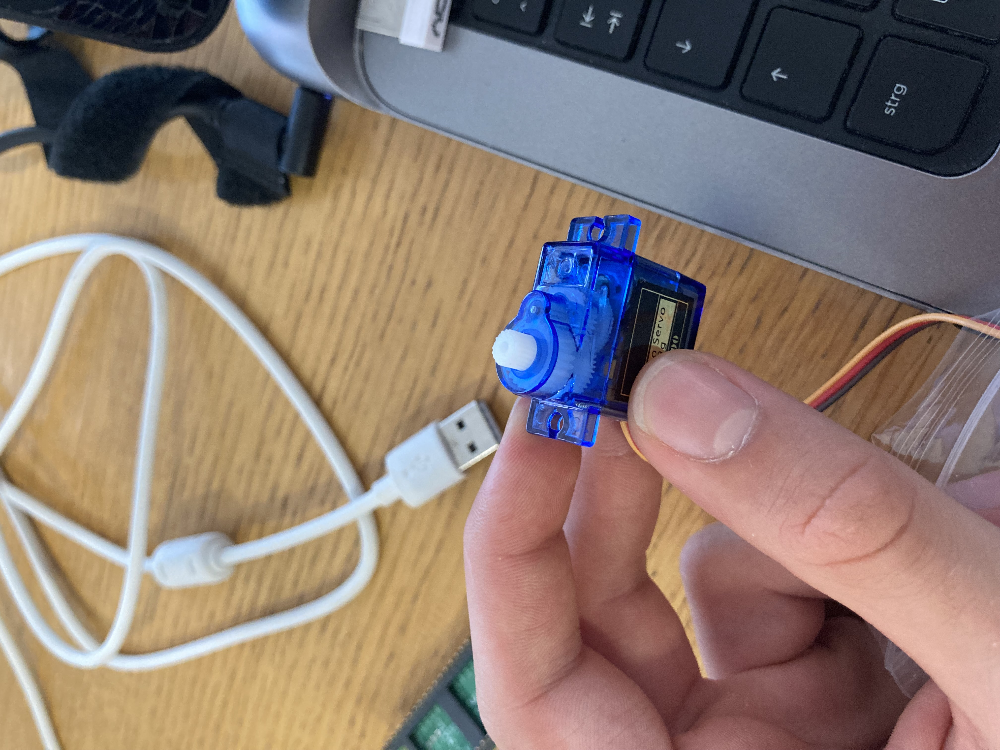

# Servo 
To us this code, you need any typical servo that works with PWD and a Raspberry Pi, to run the code. 
1. Download the code
2. open the main.py in an editor like thonny
3. connect the rpi to your computer
4. run the main.py file on the rpi 

